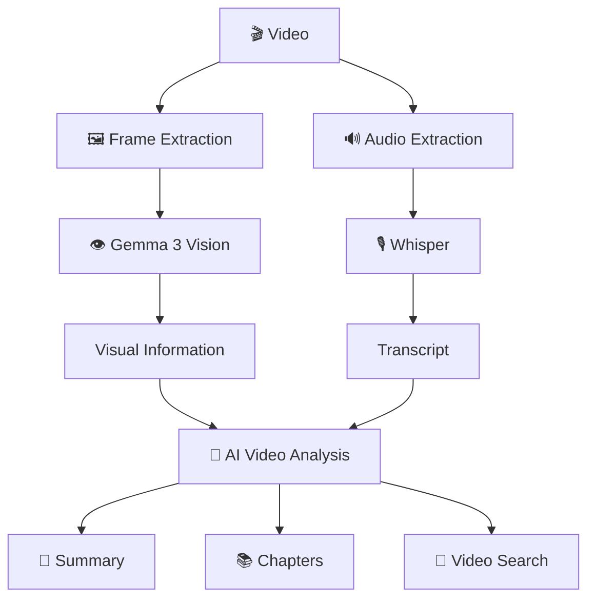

# 🎥 AI Video Analyzer

An AI-powered video analysis system that understands both **visual content and spoken audio** from videos.

The system extracts important video frames, analyzes them using a vision model, transcribes speech using Whisper, generates an AI summary, creates automatic chapters, and allows users to search for important moments using natural-language questions.

---

## ✨ Features

- 🎞️ **Video Frame Analysis** — Extracts representative frames from the video.
- 👁️ **Visual Understanding** — Uses an AI vision model to understand scenes, objects, actions, and surroundings.
- 🎙️ **Speech Transcription** — Converts spoken audio into text using Whisper.
- 📝 **AI Video Summary** — Generates a concise summary using visual and audio information.
- 📚 **Automatic Chapters** — Creates chapter titles with timestamps.
- 🔎 **Natural-Language Search** — Ask questions to find relevant moments in the video.
- ⏱️ **Timestamp Navigation** — Jump directly to important moments.
- 📄 **Downloadable Report** — Export the analysis as a text report.
- 🖥️ **Streamlit Interface** — Simple and interactive web interface.
- ⚡ **Optimized Processing** — Uses representative frame sampling and optimized Whisper processing.

---

## 🏗️ Architecture



---

## 🛠️ Technologies Used

- **Python**
- **OpenCV**
- **NumPy**
- **OpenAI Whisper**
- **Ollama**
- **Gemma 3 4B**
- **FFmpeg**
- **Streamlit**
- **Requests**
- **Pytest**

---

## 📂 Project Structure

```text
video_analyzer/
│
├── app/
│   ├── __init__.py
│   ├── chapters.py
│   ├── config.py
│   ├── describe.py
│   ├── frames.py
│   ├── llm.py
│   ├── pipeline.py
│   ├── search.py
│   ├── transcribe.py
│   └── vision.py
│
├── tests/
│   └── test_pipeline.py
│
├── app.py
├── cli.py
├── requirements.txt
├── .gitignore
└── README.md
```

---

## 🚀 How It Works

### 1. Upload a Video

The user uploads a video through the Streamlit interface.

### 2. Extract Representative Frames

OpenCV samples representative frames from the video instead of processing every frame.

### 3. Analyze Visual Content

The selected frames are sent to the **Gemma 3 vision model** through Ollama.

The model identifies visible subjects, objects, actions, and surroundings.

### 4. Extract Audio

FFmpeg extracts the audio track from the uploaded video.

### 5. Transcribe Speech

Whisper converts the spoken audio into timestamped text.

### 6. Generate AI Summary

The visual descriptions and transcript are provided to the AI model to generate a concise video summary.

### 7. Create Chapters

The system generates chapter titles for the analyzed scenes.

### 8. Search the Video

Users can ask natural-language questions such as:

```text
When are objects explained?
```

The system finds the most relevant timestamp.

---

## 🔎 Example

A user can upload an educational video and ask:

```text
When are objects explained?
```

The system can return:

```text
00:05 - The image explains that a class is a blueprint and an object is an instance of a class.
```

The user can then jump directly to that timestamp.

---

## 💡 Use Cases

### 🎓 Education

Students can quickly understand long lectures and find specific topics.

### 💼 Meetings

Important discussions and sections can be summarized and searched.

### 📺 Content Analysis

Creators can analyze educational or informational videos.

### 📚 Video Research

Researchers can quickly locate relevant information inside long videos.

---

## ⚡ Performance Optimization

The system is designed to reduce unnecessary processing.

Instead of analyzing every video frame, it uses **representative frame sampling**.

Whisper uses the lightweight `tiny.en` model for faster English transcription.

The Whisper model is also cached so it does not need to be loaded repeatedly during the same application session.

---

## 🧪 Testing

Run the tests using:

```bash
python -m pytest
```

The project currently passes its automated tests.

---

## ▶️ Running the Application

### Start Ollama

Make sure Ollama is running locally.

The project uses:

```text
Gemma 3 4B
```

### Start Streamlit

Run:

```bash
python -m streamlit run app.py
```

The application will open in your browser.

---

## 🔐 Environment

Create a `.env` file if environment-specific configuration is required.

Example:

```env
OLLAMA_URL=http://localhost:11434
VISION_MODEL=gemma3:4b
WHISPER_MODEL=tiny.en
```

Do not upload `.env` files containing private credentials.

---

## 🎯 Project Goal

The goal of this project is to build a **multimodal AI system that can understand videos instead of treating them only as collections of frames or audio**.

By combining computer vision, speech recognition, and large language models, the system provides a more useful way to understand, summarize, and search video content.

---

## 👩‍💻 Author

**Pavani Aluri**
